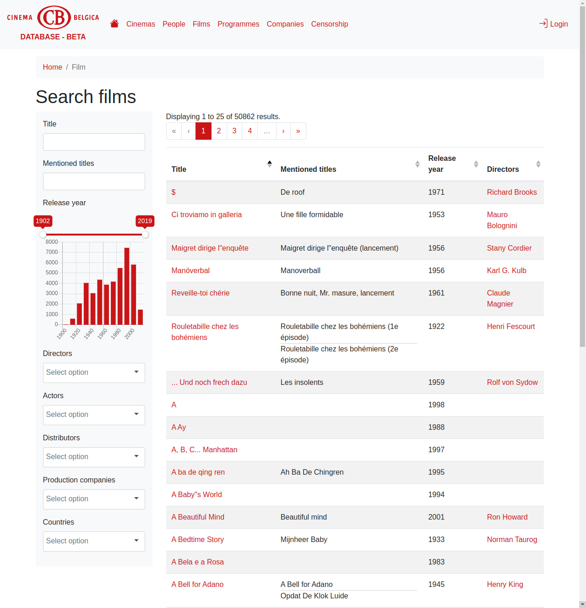

# Back-end for TripleHop

TripleHop is a platform that aims to facilitate collaborative research data creation and publication.

The back-end for TripleHop consists of a FastAPI web application connected to a PostgreSQL database with the Apache AGE extension as data storage and an Elasticsearch instance as search engine.

## Work in progress

The TripleHop platform is still a work in progress.

Currently implemented:

* Data model configuration using json files
* Basic exploration of data
* A part of the editing interface
* Data import using import scripts
* Limited GraphQL API

TO DO:

* Documentation
* Testing
* Data model configuration with a web interface
* Editing interface
* Data import using a web interface
* LOD presentation
* LOD mapping
* HDT export
* Plug-in system in the back-end and front-end, re-evaluation of the data model configuration format
* Graph visualizations
* Visual query interface

## Contributing

Please see our [contributing guidelines](CONTRIBUTING.md).

## Acknowledgements

TripleHop is and has been funded by

* [Clariah-VL](https://clariahvl.hypotheses.org/)
* [Cinema Belgica](https://www.cinemabelgica.be/)
* [Novel Echoes](https://research.flw.ugent.be/en/projects/novel-echoes)
